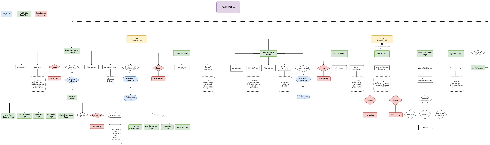

# Information Architecture for AutSPACEs
This is the IA for the AutSPACEs platform as it exists on 15/11/2021. 

## Diagram Key
Please refer to [link - how to read an IA diagram] for a guide on how to read IA diagrams. 
* Purple color is for AutSPACEs platform 
* Blue color is for external pages
    * Open Humans Authentication
    * Tiny Newsletter subscription
* Green color is for AutSPACEs platform pages
    * We have 7 separate pages in total
        * Homepage for non-logged in user
        * Homepage for logged in user
        * Success in logging in page
        * View Experiences page
        * Share Experiences page
        * My Stories page
        * Moderator Page      
* Red color is for pages/features we have designed for, but not implemented. 

### Relevant Documents
* [Figma Link](https://www.figma.com/file/HxqTSdeyAUNMualnBV0PET/Autspace-(WIP)?node-id=172%3A641)

### Diagram

[Diagram in Detail](https://viewer.diagrams.net/?tags=%7B%7D&highlight=0000ff&edit=_blank&layers=1&nav=1&title=IA_AutSPACEs.drawio#Uhttps%3A%2F%2Fdrive.google.com%2Fuc%3Fid%3D1THiziivGBr89J5x9oJahXuHtL7iib8J1%26export%3Ddownload)
